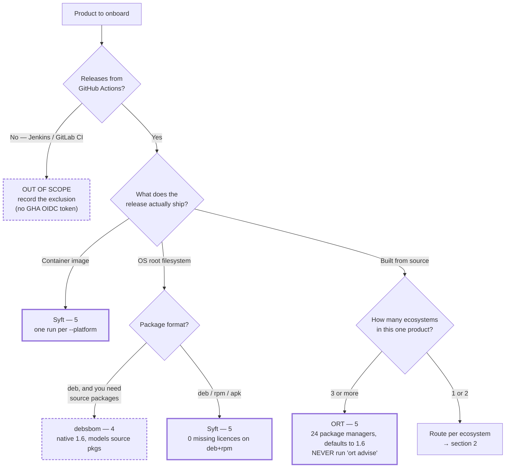

# Choosing an SBOM generator — decision matrix

Routes a product to a single generator. Every recommendation is the **highest-scoring tool for
that path**, scored against a 10-dimension rubric traced to CRA and BSI TR-03183-2
requirements.

**How to read the Score column.** **4 = CRA Annex I Part II(1) satisfied**; **5 = the
observed ceiling** (no tool reaches BSI conformance unaided). The scores stay here as the
record of why each route was chosen; what a report records is the verdict they produce:

| Score | `generator[].assessment` |
|---|---|
| **4 or 5** | `ok` |
| **1–3** | `documented-gap` — defensible only with a `coverage_gap` saying what is missing |

`CLAUDE.md`: *an SBOM omitting a significant portion of a product's dependencies is less
useful than a documented gap.*

---

## 1. Triage — scope and artifact type



**Why the container/OS branch comes first.** For an image or root filesystem the artifact *is* the
thing being described, so a scanner is the correct tool, not a fallback. Syft's edge and licence
coverage there is the best-verified in the whole catalogue (`debian:12` → 88 packages, 0 missing
licences, 81 with `dependsOn`).

**Why ORT at 3+ ecosystems.** ORT is the only polyglot tool that resolves real build graphs at
breadth *and* defaults to CycloneDX 1.6. Below 3 ecosystems the native generators score the same
or better with far less operational weight.

---

## 2. Ecosystem routing

```mermaid
flowchart LR
    ECO(["Built from source"]) --> JVM{"JVM?"}
    ECO --> WEB{"JS / Python / Go?"}
    ECO --> COMP{"Compiled?"}
    ECO --> OTHER{"Other?"}

    JVM -->|Maven| MVN["cyclonedx-maven-plugin — 5<br/>goal: makeAggregateBom"]
    JVM -->|"Gradle, plain JVM"| GRD["cyclonedx-gradle-plugin — 5<br/>drive via --init-script"]
    JVM -->|"Gradle, Android"| GRDA["cyclonedx-gradle-plugin — 4<br/>pin includeConfigs to the<br/>shipping variant"]
    JVM -->|sbt| SBT["sbt-sbom — 5<br/>enable includeBomTimestamp"]
    JVM -->|Mill| MILL["cdxgen -t mill — 4<br/>Mill contrib is 2: spec 1.2, no graph"]
    JVM -->|Clojure| CLJ["clojure -X:deps mvn-pom<br/>→ cyclonedx-maven-plugin — 4<br/>drops :git/url and :local/root"]

    WEB -->|npm| NPM["@cyclonedx/cyclonedx-npm — 5<br/>default is already 1.6"]
    WEB -->|"Yarn berry (v4+)"| YRN["yarn-plugin-cyclonedx — 5"]
    WEB -->|pnpm| PNPM["pnpm sbom — 5<br/>built in; pass --sbom-spec-version 1.6"]
    WEB -->|"Yarn 1.x classic"| YRN1["NO SUPPORTED PATH<br/>migrate to berry, or scanner + gap"]
    WEB -->|Python| PY["cyclonedx-py environment — 5<br/>introspect a resolved venv"]
    WEB -->|Go| GO["cyclonedx-gomod app — 5<br/>-licenses -assert-licenses"]

    COMP -->|.NET| NET["CycloneDX for .NET — 5<br/>restore with the shipped TFM/RID"]
    COMP -->|Rust| RS["cargo-sbom — 4<br/>cargo-cyclonedx resolves better<br/>but is capped at 1.5 = 3"]
    COMP -->|"C/C++ via Conan"| CONAN["Conan cyclone_1.6 deployer — 4<br/>root component lacks 'version'"]
    COMP -->|"C/C++ via vcpkg"| VCPKG["Syft vcpkg-manifest-cataloger — 4<br/>only C/C++ cataloger with complete edges"]
    COMP -->|"C/C++ CMake or Make only"| CPPGAP["NO VIABLE PATH<br/>blint or Syft = 2<br/>record the gap"]
    COMP -->|Swift / iOS| SWIFT["cdxgen -t swift / -t cocoapods — 4<br/>covers SPM AND CocoaPods"]

    OTHER -->|PHP| PHP["cyclonedx-php-composer — 5<br/>--output-format=JSON --spec-version=1.6"]
    OTHER -->|Ruby| RB["bundler-sbom — 4<br/>+ convert 1.7 → 1.6"]
    OTHER -->|Elixir| EX["mix_sbom — 5<br/>default is already 1.6"]
    OTHER -->|Erlang| ERL["rebar3_sbom — 4<br/>pin prerelease 0.9.0-beta.1"]
    OTHER -->|Dart / Flutter| DART["cdxgen -t dart — 4<br/>needs a committed pubspec.lock"]
    OTHER -->|Perl| PERL["App::CPAN::SBOM — 4<br/>MUST pass --maxdepth 10"]
    OTHER -->|OCaml| OCAML["ocaml-sbom — 5<br/>build from a pinned git tag"]
    OTHER -->|Nix| NIX["sbomnix — 3<br/>1.4 → convert; pkg:nix is not a purl type"]
    OTHER -->|Conda| CONDA["cyclonedx-py environment — 3<br/>Python subset only"]
    OTHER -->|"R / Haskell / Lua"| LOWGAP["NO VIABLE PATH<br/>Syft = 2, flat list<br/>record the gap"]
    OTHER -->|Terraform / IaC| TF["EXCLUSION<br/>no purl type, no runtime graph"]

    classDef five stroke-width:3px
    classDef four stroke-width:2px
    classDef gap stroke-dasharray:5 3,stroke-width:2px
    class MVN,GRD,SBT,NPM,YRN,PNPM,PY,GO,NET,PHP,EX,OCAML five
    class GRDA,MILL,CLJ,RS,CONAN,VCPKG,SWIFT,RB,ERL,DART,PERL four
    class YRN1,CPPGAP,NIX,CONDA,LOWGAP,TF gap
```



---

## 3. The matrix

Solid line = 5, thin = 4, dashed = below the CRA line.

**Control** is how CycloneDX 1.6 is obtained from the tool, and is recorded on every
`generator` entry. It is the field most likely to be invalidated by a tool update, and the
one whose silent drift produces a document the registry rejects:

| Control | Meaning |
|---|---|
| `native-1.6` | Emits 1.6 by default. Still assert it — defaults move |
| `flag` | Needs an explicit selector flag |
| `output-suffix` | Encoded in the `-o` argument |
| `convert-required` | Cannot emit 1.6 at all; a `cyclonedx-cli convert` step is mandatory |

| Ecosystem / condition | Tool | Score | Control | Non-negotiable invocation | Gap to record |
|---|---|---:|---|---|---|
| Container image | Syft | **5** | `output-suffix` | `-o cyclonedx-json@1.6`; one run per `--platform` | Distroless/`scratch`: no package DB → file components, no purls |
| OS filesystem (deb/rpm/apk) | Syft | **5** | `output-suffix` | `-o cyclonedx-json@1.6` | Debian source packages not modelled |
| Debian, source packages needed | debsbom | **4** | `native-1.6` | `-t cdx --with-licenses` | **813 of 1,194 components unlicensed** in a verified run |
| 3+ ecosystems in one product | ORT | **5** | `flag` | `analyze` → `report`; **never `advise`** | Operational weight; per-ecosystem config |
| Maven | cyclonedx-maven-plugin | **5** | `flag` | `makeAggregateBom`, `-DschemaVersion=1.6`, `-DoutputFormat=json` | `provided`/`system` scopes included by default |
| Maven, Tycho | cyclonedx-maven-plugin | **4** | `flag` | Same, against the Tycho reactor | P2/OSGi units resolve outside Maven coordinates |
| Gradle, plain JVM | cyclonedx-gradle-plugin | **5** | `flag` | `--init-script`; glob for the output path | Upstream docs disagree on the output path — glob, do not hardcode |
| Gradle, Android | cyclonedx-gradle-plugin | **4** | `flag` | **`includeConfigs` = shipping variant** | Default merges debug + test configurations |
| sbt | sbt-sbom | **5** | `flag` | Pin `bomSchemaVersion`; **enable `includeBomTimestamp`** | Timestamp/serial off by default; BSI field 2 is mandatory |
| Mill | cdxgen `-t mill` | **4** | `flag` | `--spec-version 1.6` | Mill contrib scores 2: spec 1.2, no graph, no purls |
| Clojure | `mvn-pom` bridge → cyclonedx-maven-plugin | **4** | `flag` | `clojure -X:deps mvn-pom` or `lein pom` first | `:git/url`, `:local/root`, alias-only deps are lost |
| npm | `@cyclonedx/cyclonedx-npm` | **5** | `native-1.6` | `npm ci` first; `--validate` | Workspace flags experimental |
| Yarn berry (≥ 4) | `yarn-plugin-cyclonedx` | **5** | `flag` | `yarn install --immutable`; `--spec-version 1.6` | No `--validate`; validate separately |
| Yarn 1.x classic | cdxgen `-t js` | **2–3** | `flag` | `cdxgen -r -t js --spec-version 1.6 -o "$SBOM" .` | **No native generator exists.** Remediation: migrate to Yarn ≥ 4 and re-run |
| pnpm (≥ 11) | `pnpm sbom` | **5** | `flag` | **`--sbom-spec-version 1.6`** (default is 1.7) | `--lockfile-only` loses licence/author data |
| Python | `cyclonedx-py environment` | **5** | `flag` | Point at a **resolved venv**, not a manifest | `requirements` mode drops to 2 |
| Go | `cyclonedx-gomod app` | **5** | `flag` | `-licenses -assert-licenses`; set GOOS/GOARCH | One SBOM per build-matrix target |
| .NET | CycloneDX for .NET | **5** | `flag` | **`-spv 1.6`** (default 1.7); same TFM/RID as shipped | Solution inputs give an arbitrary union |
| Rust | cargo-sbom | **4** | `flag` | `--output-format cyclone_dx_json_1_6` | No build-dep scoping → over-reports; thin licences |
| C/C++ via Conan | Conan `cyclone_1.6` deployer | **4** | `native-1.6` | `--deployer=cyclone_1.6` | **`metadata.component` has no `version`**; experimental |
| C/C++ via vcpkg | Syft `vcpkg-manifest-cataloger` | **4** | `output-suffix` | `--select-catalogers '+vcpkg-manifest-cataloger'` | Manifest resolution, not the realised build; no triplets |
| C/C++ CMake/Make only | — | — | — | — | **No viable path.** blint/Syft = 2, no versions, no graph |
| Swift / iOS | cdxgen `-t swift` / `-t cocoapods` | **4** | `flag` | `--spec-version 1.6`; `FETCH_LICENSE=true` | Carthage unsupported everywhere |
| PHP | cyclonedx-php-composer | **5** | `flag` | **`--output-format=JSON --spec-version=1.6 --omit=dev`** | Defaults to XML at 1.5 |
| Ruby | bundler-sbom | **4** | `convert-required` | `--without development:test`, then convert 1.7 → 1.6 | Spec version hardcoded; full edge coverage unestablished |
| Elixir | mix_sbom | **5** | `native-1.6` | `--only prod`; `-r` for umbrellas | `MIX_ENV` does not select what is emitted |
| Erlang | rebar3_sbom | **4** | `native-1.6` | Pin `0.9.0-beta.1` or a `main` git ref | **No stable release emits 1.6** |
| Dart / Flutter | cdxgen `-t dart` | **4** | `flag` | `dart pub get` first — needs `pubspec.lock` | Flutter native plugin deps entirely uncovered |
| Perl | App::CPAN::SBOM | **4** | `native-1.6` | **`--maxdepth 10`** (default 1 = direct only) | No polyglot fallback exists at all |
| OCaml | ocaml-sbom | **5** | `native-1.6` | Build from a pinned git tag | v0.1.0, not in `opam-repository` |
| Nix | sbomnix + convert | **3** | `convert-required` | `cyclonedx-cli convert --output-version v1_6` | **`pkg:nix` is not a registered purl type** |
| Conda | `cyclonedx-py environment` | **3** | `flag` | Point at the conda env's Python | **Silently omits every non-Python conda package** |
| R | Syft over an renv library | **2** | `output-suffix` | — | **No dependency information whatsoever** |
| Haskell / Lua | Syft | **2** | `output-suffix` | — | No graph; Haskell also has no licences |
| snap | — | — | — | — | **No generator exists in the catalogue.** No re-run helps |
| Terraform / IaC | — | — | — | — | **Exclusion.** No purl type, no runtime dependency graph |

### 3.1 Runnable form of the artifact-type and polyglot routes

The rows above give the non-negotiable flags. These three routes have enough moving parts
to be worth writing out in full. **Re-resolve every version at generation time** — the
tool names are stable, the versions are not.

**Container image, and OS filesystem — Syft**

```bash
syft scan "registry:${IMAGE}@${DIGEST}" -o "cyclonedx-json@1.6=${SBOM}"   # image, by digest
syft scan "dir:${ROOT}"                 -o "cyclonedx-json@1.6=${SBOM}"   # filesystem
```

Scan the **published digest**, never a rebuilt image — a rebuild is a different artifact.

**Debian with source packages — debsbom**

```bash
debsbom generate -t cdx --with-licenses -o "${SBOM}"
```

**3+ ecosystems in one checkout — ORT**

```bash
docker run --rm -v "$PWD:/project" -v "$PWD/ort-out:/out" "${ORT_IMAGE}" \
  analyze -i /project -o /out/analyzer -f JSON
docker run --rm -v "$PWD/ort-out:/out" "${ORT_IMAGE}" \
  report -i /out/analyzer/analyzer-result.json -o /out/report \
    -f CycloneDx -O CycloneDx=schema.version=1.6 -O CycloneDx=output.file.formats=JSON
```

`ORT_IMAGE` must be pinned **by digest** — a tag is mutable, and the rest of the workflow
is SHA-pinned. **Never run `ort advise`**: the CycloneDX reporter calls
`addVulnerabilities(ortResult.getVulnerabilities())`, which is empty until the advisor has
run and would breach BSI TR-03183-2.

### 3.2 Routes that must never be taken

| Do not | Because |
|---|---|
| `ort advise` | Populates `vulnerabilities[]`, breaching BSI TR-03183-2 |
| Trivy without the 1.7 → 1.6 conversion | Emits 1.7 with no selector, and always emits the `vulnerabilities` key |
| `microsoft/sbom-tool` | SPDX only. Converting to CycloneDX is lossy |
| `cargo-cyclonedx` | The better *resolver*, but capped at 1.5 — below the BSI floor. Displaces `cargo-sbom` only once its 1.6 support ships (§4) |
| Per-ecosystem `CycloneDX/gh-*-generate-sbom` actions | Deprecated with upstream notices, or unmaintained on sunset runtimes. Invoke the CLIs directly |
| `spdx/spdx-sbom-generator`, `CycloneDX/cdxgen-action`, `tern` | Archived or unmaintained |

---

## 4. Where two tools tied, and how it was broken

Two paths had joint-highest scores. Both were resolved on stated rules, not preference.

| Path | Tie | Chosen | Rule applied |
|---|---|---|---|
| Ruby | bundler-sbom **4** vs cdxgen **4** | **bundler-sbom** | `CLAUDE.md`: *ecosystem-native generators are preferred over universal scanners.* bundler-sbom is a real Bundler plugin with group scoping and SPDX licence validation. **Cost of the choice:** it hardcodes 1.7, so a `cyclonedx-cli convert` pass is mandatory — and cdxgen handles the `platform` purl qualifier correctly while bundler-sbom's coverage of it is unrecorded. If the conversion step is unacceptable, cdxgen at the same score is a defensible swap. |
| Swift / iOS | cyclonedx-cocoapods **4 ⚠** vs cdxgen **4** | **cdxgen** | The native tool carries an unresolved risk: released gem 2.0.1 has a **known CycloneDX 1.6 licence non-conformance**, and if that fails schema validation it drops to 1. An unqualified 4 beats a ⚠ 4. cdxgen also covers SPM *and* CocoaPods, which no other single tool does. **Revisit when 2.0.2 ships** — the native tool is the better answer once the licence bug is released. |

**Not a tie, but worth stating:** for **Rust**, `cargo-cyclonedx` is the better *resolver* — it
invokes Cargo, so it gets real feature and target resolution and scopes build-deps out. It scores
**3** only because it caps at CycloneDX 1.5, below the BSI floor. `cargo-sbom` wins at **4** on
format alone. If PR #872 lands and `cargo-cyclonedx` reaches 1.6, it should displace `cargo-sbom`
immediately.

---

## 5. Applies to every path

Four checks, independent of the tool chosen. The first three are cheap guards against the failure
modes that recur across every ecosystem.

```bash
jq -e '.specVersion == "1.6"'        bom.json   # spec drift: 6+ tools default above 1.6
jq -e '(.dependencies | length) > 0' bom.json   # the most common failure: a flat component list
jq -e 'has("vulnerabilities") | not' bom.json   # BSI-F2: Trivy and ORT are one flag from breaching
jq -e '(.components | length) > 0'   bom.json
```

1. **Pin and assert the spec version.** Syft, cdxgen, `pnpm sbom`, cyclonedx-dotnet,
   cyclonedx-ruby and SwiftPM all default **above** 1.6; Trivy and osv-scalibr emit 1.7 with no
   selector. This will drift again.
2. **Assert `dependencies[]` is non-empty.** Where a tool structurally cannot emit edges, emit a
   `::warning::` and record the gap — do not fail silently.
3. **Assert no vulnerability data.** Trivy always emits the key; ORT populates it if `advise` ran.
4. **Resolve with the inputs the release actually uses** — GOOS/GOARCH, `CARGO_BUILD_TARGET`,
   TFM/RID/Configuration, `includeConfigs`, `--only prod`, `--omit=dev`,
   `--without development:test`. An SBOM resolved for the wrong target describes something that
   was never shipped.

### The ceiling applies to every path too

**No route on this page reaches BSI TR-03183-2 conformance on its own.** The best tools stop at
**5**; band 7 needs a post-processing step in the same workflow supplying BSI required fields 3,
6, 9, 10, 11 and 12 — component creator as email/URL, filename, SHA-512 deployable hash, and the
executable/archive/structured properties — plus `compositions[].aggregate`. Those are properties
of *delivered files*, not of *resolved coordinates*, so no dependency resolver can produce them.
Choosing a different generator will not close this gap.

---

## Caveats

- Scores are **not measured runs.** They were derived from verified structural behaviour; the
  rubric's recall/precision/edge-recall dimensions require executing the tool against a pinned
  test product, which was never done. Treat a score as a strong prior, not a measurement.
- **Scores are per triple** `(tool, ecosystem, archetype)`. `cyclonedx-py` scores 5 for PyPI and 3
  for conda — same tool, same version. Re-score if your archetype differs from the one assumed
  here.
- Source research is dated **2026-08-05**. Four generators changed their default spec version in
  the preceding year; re-verify before pinning.
